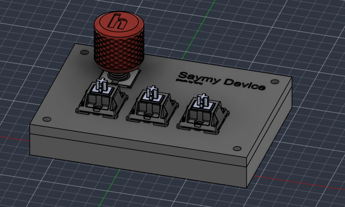
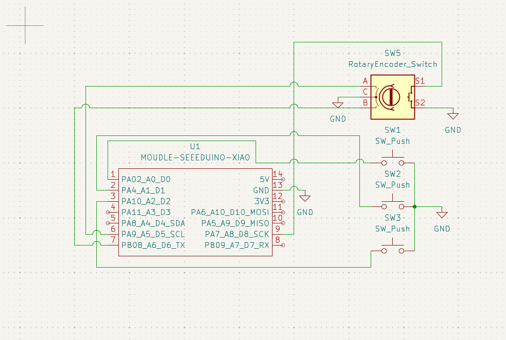
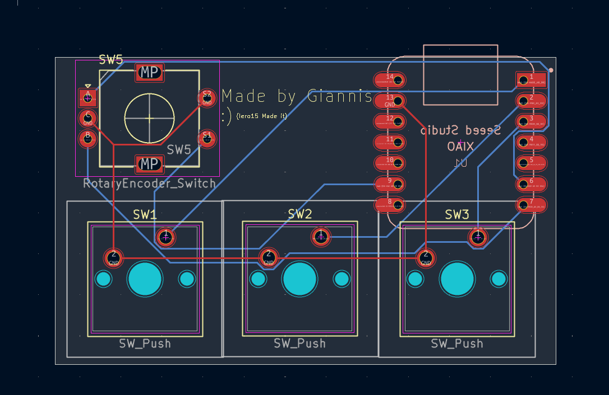
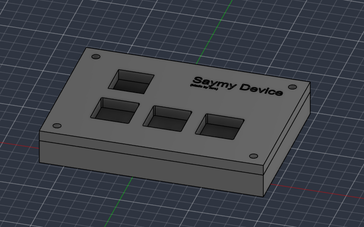

# SayMy_Device

A simple 3-key macropad for playing Geometry Dah and OSU!

---

## Screenshots

### Schematic

### PCB

### Case

---

## Bill of Materials (BOM)

| Part | Quantity |
|------|----------|
| Cherry MX Switches | 3 |
| DSA Keycaps | 3 |
| Seeeduino XIAO | 1 |
| PCB | 1 | 
| M3x16mm screws | 4 |
| M3x5x4 Heatset inserts | 4 |
| EC11 Rotary encoder | 1 |
---

## Firmware

Built with QMK firmware
